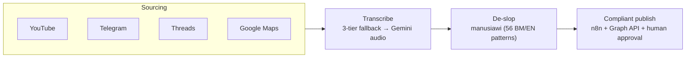

# Hi, I'm Ahmad Afif

I build data pipelines and complete products end-to-end — scraper → pipeline →
SaaS → deployment. Based in Malaysia.

A few things I hold myself to on every project:

- **Ethical, compliant scraping.** My own browser sessions, official APIs where
  they exist, and a human approval gate before anything gets published or sent out.
- **Production-hardened pipelines.** Resource caps, incremental merge, systemd
  services. I've had things fall over in production before, and I don't want
  to repeat that.
- **Malaysian-first products.** Bahasa Melayu NLP and local payment rails,
  built for people here — not bolted on as an afterthought.
- **Privacy-by-design.** On-device ML, client-side calculation, self-hosted
  infrastructure where it makes sense.

## What I've shipped

- **[Whisper-Malay](https://github.com/ahmadafif5321/Whisper-Malay)** — on-device
  Bahasa Melayu speech-to-text for Android. Runs Whisper through ONNX fully
  offline, so recordings never leave the phone.
- **[manusiawi](https://github.com/ahmadafif5321/manusiawi)** — a Claude skill
  that strips AI writing patterns out of Malaysian Bahasa Melayu text. Covers
  56 BM/EN patterns and also catches Indonesian-language intrusion.
- **[GoogleMapScrapper](https://github.com/ahmadafif5321/GoogleMapScrapper)** —
  a 24/7 Google Maps review collector. Hardened with resource caps and DuckDB
  incremental merge after it OOM'd on me in production.
- **[Thread_Scrapper](https://github.com/ahmadafif5321/Thread_Scrapper)** — a
  Threads keyword-intelligence pipeline built around a swappable ingestion
  provider, so the data source can change without touching the pipeline.
- **[MUTe](https://github.com/ahmadafif5321/MUTe)** — a YouTube-to-Bahasa-Melayu
  content pipeline: discover videos, transcribe them, rewrite for a Malaysian
  audience.
- **[Powershell-Citrix](https://github.com/ahmadafif5321/Powershell-Citrix)** —
  Citrix XenApp operations scripts from my day job, for when scraping isn't
  the only automation that needs doing.

## How my content toolchain fits together

## Currently
- Writing at [ahmadafif.com](https://ahmadafif.com) — production war stories and
  Malaysian-first product notes.
